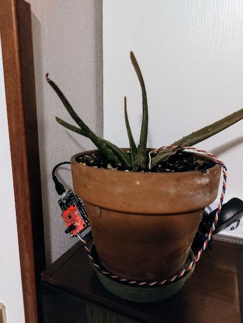

# Home garden monitor using AD8232

This is a sample project I did to spend some time in programming, I had an AD8232 evaluation board lying around and I wanted to find a way to use it for my garden (as I am not specially skilled in gardening).

## Required material

- NodeMCU 1.0 (ESP12E)
- AD8232 evaluation board
- Breadboard and jumper wires (if needed)
- InfluxDB server

## Description

This code samples the signals from the plant and generates the FFT, which can later be analyzed to monitor the status of the flower

## Configuration

### Wiring

- Wire the 3V3 pin of the AD8232 board to the 3V pin of the NodeMCU
- Wire the GND pin of the AD8232 board to the GND pin of the NodeMCU
- Wire the OUTPUT pin of the AD8232 board to the A0 pin of the NodeMCU
- Wire the RA and LA pins of the AD8232 to two metal rods close to the roots of the plant
- Wire the RL pin of the AD8232 board to a metal plate on the bottom of the pot (make sure to be far enough from the metal rods and the roots)

### Software setup

- Create a `secrets.h` file in the `include` folder
    - Add a line containing `#define WIFI_SSID "your wifi ssid"` and configure it properly
    - Add a line containing `#define WIFI_PASS "your wifi password"` and configure it properly
    - Add a line containing `#define SENSOR_NAME "your flower pot name"` and configure it properly
    - Add a line containing `#define INFLUXDB_URL "http://192.168.X.Y:8086"` and configure it properly
    - Add a line containing `#define INFLUXDB_TOKEN "token"` and configure it properly
    - Add a line containing `#define INFLUXDB_ORG "org"` and configure it properly
    - Add a line containing `#define INFLUXDB_BUCKET "bucket"` and configure it properly

### Deploy

- Connect the NodeMCU to the device
- Make sure Platform.io is installed on Visual Studio Code
- Move to the Platform.io extension
- Select `nodemcuv2` from the list
- Click `Upload`

## FFT Test

A sample [Jupyter script](./python/main.ipynb) is provided in the `python` folder to be tested
